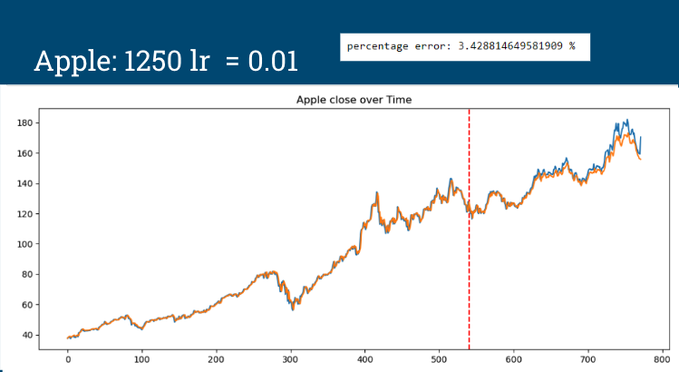
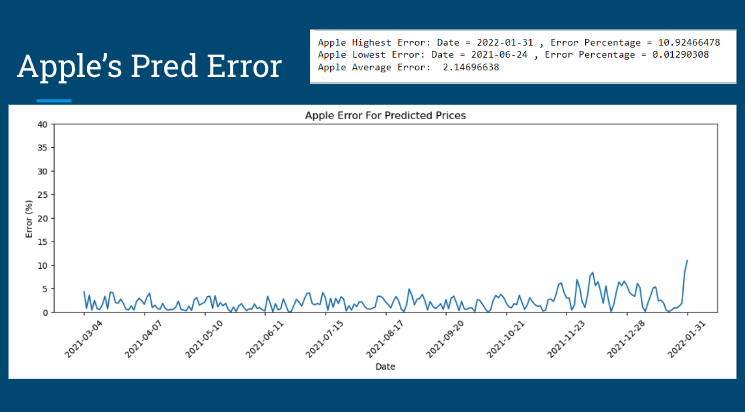
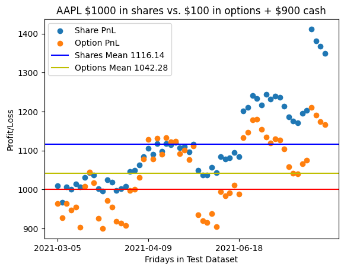
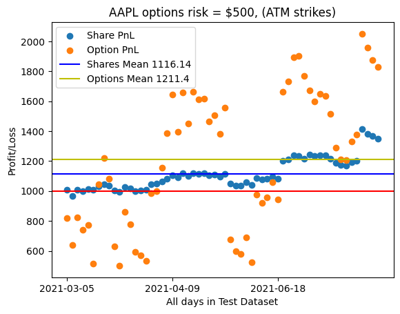
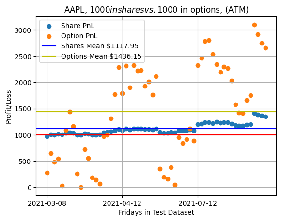
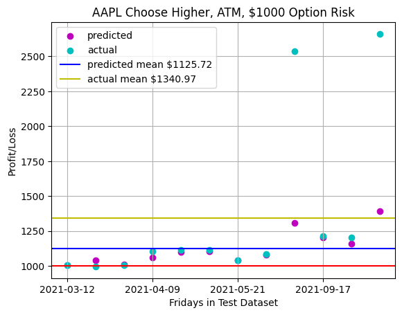
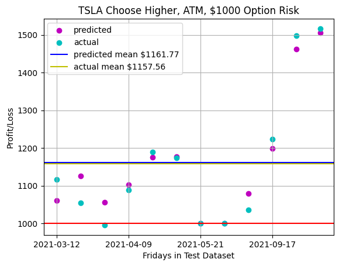
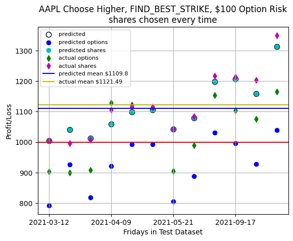
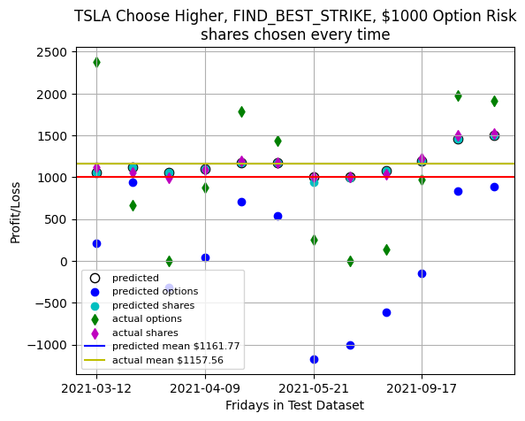

# Leveraging LSTM Stock Price Predictions With Options

Authors: Schuyler Asplin, Vlad Shingarey, Parker Groop

This project is broken into 2 main parts:

1. Using Long Short Term Memory to attempt stock price prediction
2. Attempting to find a buy-side, option-based strategy that achieves better average returns than using LSTM to bet on the shares (or similar returns with reduced risk).

# Part 1: Predicting Price

We attempted to predict price using only price history. The results seem too good to be true, so I'm currently working to verify that the prediction never benefit from information it shouldn't have access to. The result of our price predictions are below in orange, with the actual price in blue:

# Part 2: Leveraging Predictions With Options

# 2.1 Risk
The idea of using options to leverage predictions is primarily to allow for greater control over risk. Using price for predictions, while well precidented by technical analysis, has a fundamentally arbitrary nature. Fine tuned control over risk is vital to finding optimized utilization of any kind of price prediction.

# 2.1 Choose Higher
Because of the extremely bullish nature of the time period, not only were put options never selected, but call options were never predicted to outperform. We can see two instances in the AAPL plot where the opportunity was present, but the algorithm was not able to pick up on it.

# 2.3 Find_Best_Strike vs ATM:
These plots are a work in progress, but the idea of 'FIND_BEST_STRIKE' is that OPT will iterate through all the OTM calls/puts and save the one with the intrinsic value at expiration given the predicted price.
We can do this for expiration days without introducing extra uncertaintity because the intrinsic value at expiration is a function of price, and extrinsic value at expiration is 0.

This method is wildly insufficient and doesn't capitalize on gamma at all. An OTM option above the predicted price might sell for a 0.01 on the prediction date, and then go up to 0.08 as the price moves in that direction. In other words, the best play for a bullish prediction may be to buy many calls far above the predicted price and sell them BEFORE expiration. If we can define a rule-based exit strategy, then we can check the days

There are so, so many directions to take this project, but one big improvement I'd like to add is the ability to make multiple trades within a time frame, reassessing at each point in time by rerunning the predictions with the new data.

This is the tip of the iceberg in terms of leveraging price predictions with options, and I'm sure that with more work we'll find reliable strategies. The fact that it hasn't been easier to use the buy-side of the volatility market to increase returns has, however, reignited my interest in and bias toward the sell-side. If more work doesn't begin to yield results in favor of utilizing options then I'll switch my focus back to short-vol, theta based strategies.

-Schuyler Asplin
